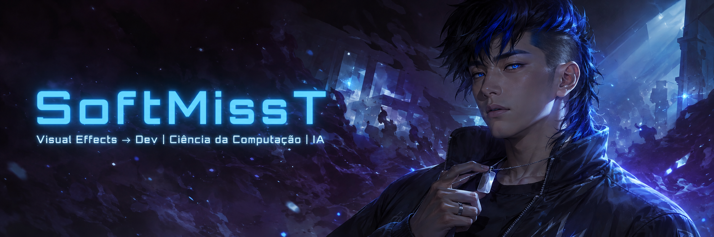
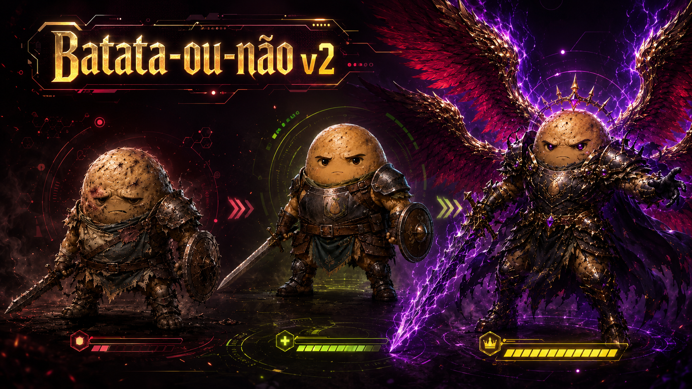

- 🎬 Especialista em **Efeitos Visuais** migrando para o desenvolvimento
- 🎓 Estudante de **Ciência da Computação**
- 🔮 Foco atual em **Inteligência Artificial** e _vibe coding_
- ⚔️ Crio módulos e automações para **Foundry VTT** (RPG de mesa)
- 📍 Arujá/SP, Brasil

---

---

<table>
<tr>
<td width="110" align="center"></td>
<td>
<b><a href="https://github.com/SoftMissT/tudo-sobre-vibe-coding">tudo-sobre-vibe-coding</a></b> 
Hub de conhecimento sobre <i>vibe coding</i>: programação guiada por IA, agentes e contexto
</td>
</tr>
<tr>
<td width="110" align="center"></td>
<td>
<b><a href="https://github.com/SoftMissT/FoundryVTT-BatataOuN-o-V2">FoundryVTT-BatataOuNão-V2</a></b> 
Módulo para Foundry VTT
</td>
</tr>
<tr>
<td width="110" align="center"></td>
<td>
<b><a href="https://github.com/SoftMissT/foundry-vtt-connection-guard">foundry-vtt-connection-guard</a></b> 
Monitora latência e diagnostica a conexão com o servidor da mesa
</td>
</tr>
<tr>
<td width="110" align="center"></td>
<td>
<b><a href="https://github.com/SoftMissT/lumenn-lightweight">lumenn-lightweight</a></b> 
Otimiza imagens no Foundry VTT (v1, vídeo em v2), com modo lote
</td>
</tr>
<tr>
<td width="110" align="center"></td>
<td>
<b><a href="https://github.com/SoftMissT/Lumenn-Frame">Lumenn-Frame</a></b> 
Melhora a experiência de mestres e jogadores no Foundry VTT
</td>
</tr>
</table>

---

---

_Feito nas sombras, com 🩸, café e vibe coding._

